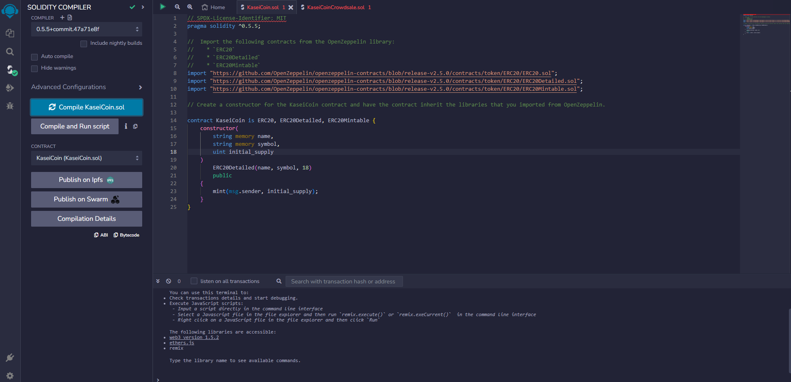
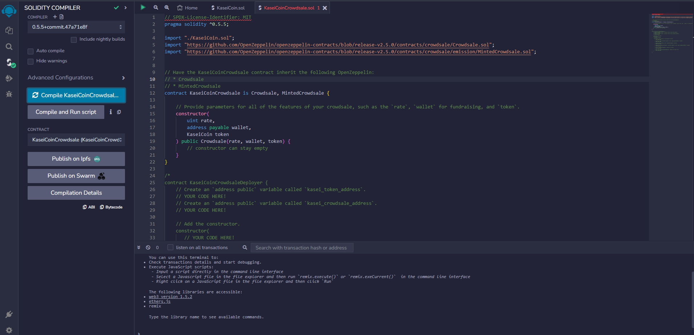
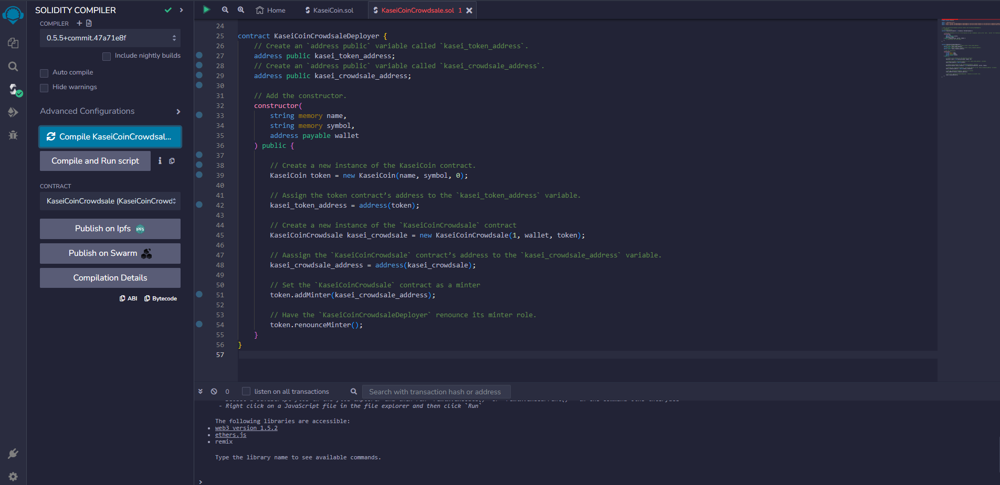
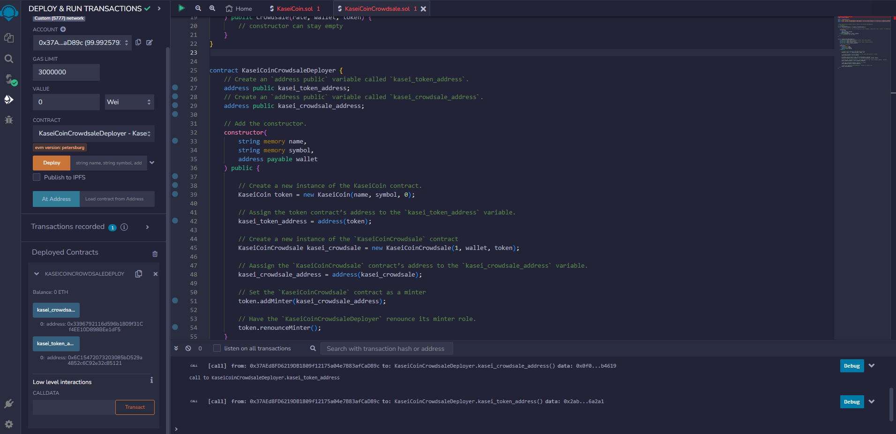

# Module-21-Assignment - KaseiCoin

### by Alex Melino

#

## Assignment Overview

This assignment covers the creation of a new hypothetical token to serve as a future Mars currency called KaseiCoin. The token is a smart contract deployed on the Ethereum blockchain using a combination of RemixIDE, Ganache, and Metamask. The .sol files contain the Solidity code for the creation and crowdsale of the KaseiCoin, while the addresses used for deployment and testing were obtained through Ganache. Ganache was then linked to the Metamsk wallet application.

#

## Evaluation Evidence

The *'Media'* folder contains screenshot evidence of the code and successful compilation of the KaseiCoin contracts, as well as a screenshot of the new token address and crowdsale address. These screenshots can also be seen below:

#

#

#

#

#

## Evaluation Evidence - Video Clips

Video clips of the tokens being created and confirmed through Metamask, as well as the confirmation of crowdsale funds being generated, and confirmation of the new KaseiCoin balance can be found on this Google Drive: 
https://drive.google.com/drive/folders/1beSYOixQAGj66o7fqihVaBVIu8nrI697?usp=drive_link